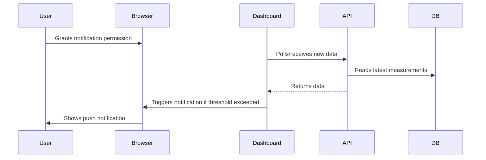
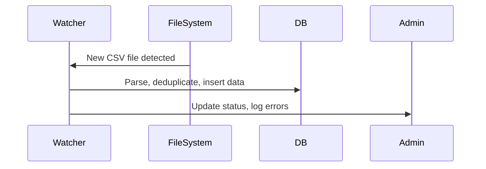

# Noise Monitoring Dashboard - Technical Documentation

---

## 📖 Table of Contents

1. [Project Overview](#project-overview)
2. [Implemented Features](#implemented-features)
3. [System Architecture](#system-architecture)
4. [Technology Stack](#technology-stack)
5. [Project Structure](#project-structure)
6stallation & Setup](#installation--setup)7 [Configuration](#configuration)
8sage Guide](#usage-guide)9 [API Reference](#api-reference)
10. [Database Schema](#database-schema)
11. [Security & Privacy](#security--privacy)
12. [Deployment](#deployment)
13. [Troubleshooting](#troubleshooting)
14lossary](#glossary)

---

## 1. Project Overview

The **Noise Monitoring Dashboard** is a real-time web platform for environmental noise and weather monitoring at events, festivals, and public spaces. It is designed for:
- **Event organizers** (compliance, live monitoring, reporting)
- **Technical staff** (infrastructure, troubleshooting)
- **Stakeholders** (public relations, transparency)

**Key Goals:**
- Provide actionable, real-time insights
- Enable rapid response to threshold violations
- Support historical analysis and reporting

---

## 2. Implemented Features

### Real-Time Data Pipeline
- **15-min interval aggregation** (configurable)
- **Multi-station support** (4 locations: ort, techno, heuballern, band)
- **Weather correlation** (wind, humidity, direction)
- **Database storage** with SQLite

### Alerts & Notifications
- **Push notifications** (browser-based)
- **Configurable thresholds**: 55 dB (Warning) and 60)
- **Notification anti-spam**: 1 alert per threshold per 5 minutes
- **Browser permission handling**

### Data Visualization
- **KPI cards**: Current, average, max, trend, status
- **Interactive charts**: Recharts with weather overlays
- **Time intervals**: 24h and 7-day views
- **Export functionality**: CSV export for data analysis

### Automation & Admin
- **CSV watcher**: Monitors directories every 10 seconds
- **Manual import**: Admin UI for on-demand processing
- **Health dashboard**: DB status, watcher status, file info
- **Duplicate detection**: Prevents double processing

### PWA & Mobile
- **Installable**: Manifest and meta tags
- **Mobile-first design**: Responsive layout
- **Add to Home Screen**: Mobile installation button

---

## 3. System Architecture

### High-Level Diagram
```mermaid
graph TD
  subgraph User
    A[Browser / Mobile Device]
  end
  subgraph Frontend
    B[Next.js React App]
  end
  subgraph Backend
    D[API Routes (Next.js)]
    E[CSV Watcher]
    F[Database (SQLite)]
    GWeather Fetcher]
  end
  subgraph External
    H[Weather API (weisserstein.info)]
    ICSV Files]
  end
  A <--> B
  B <--> D
  D <--> F
  D <--> G
  G <--> H
  E <--> I
  E <--> F
```

### Notification Flow


### CSV Ingestion Flow


---

## 4. Technology Stack

- **Frontend**: Next.js 15act 18TypeScript5 **Styling**: Tailwind CSS, Framer Motion
- **Charts**: Recharts (with custom tooltips)
- **Database**: SQLite (better-sqlite3, file-based)
- **Weather API**: weisserstein.info (regex parsing)
- **Notifications**: Browser Notifications API
- **CSV Parsing**: papaparse (robust, handles edge cases)

---

## 5. Project Structure

```
noise-monitoring-dashboard/
├── app/
│   ├── dashboard/          # Dashboard pages (all, ort, techno, heuballern, band, export, admin)
│   └── api/                # API routes (weather, station-data, process-csv, csv-watcher-status)
├── components/
│   ├── ui/                 # UI components (cards, buttons, tooltips, etc.)
│   └── theme-provider.tsx
├── hooks/
│   └── useStationData.ts   # Data fetching and aggregation hook
├── lib/
│   ├── db.ts               # Database logic
│   ├── weather.ts          # Weather integration
│   ├── csv-watcher.ts      # File watcher for CSVs
│   └── utils.ts            # Utility functions
├── public/
│   ├── manifest.json       # PWA manifest
│   └── csv/                # CSV data files (per station)
├── package.json            # Dependencies and scripts
├── README.md               # Quickstart and German docs
└── DOCUMENTATION.md        # This file
```

---

##6stallation & Setup

### Prerequisites
- Node.js 18 pnpm (recommended) or npm
- SQLite3 (CLI for manual DB inspection)

### Quick Start
```bash
# Clone the repository
git clone <repository-url>
cd noise-monitoring-dashboard

# Install dependencies
pnpm install

# Start the development server
pnpm dev
```

### Environment Variables
Create a `.env` file (optional):
```env
DATABASE_PATH=./data.sqlite  # Path to SQLite DB
```

### Production Build
```bash
pnpm build
pnpm start
```

---

## 7Configuration

### Adding a New Station
1Place CSV files in `public/csv/<station-name>/`
2. Create a dashboard page in `app/dashboard/<station-name>/page.tsx`3tion to navigation in `app/dashboard/layout.tsx`

### Thresholds & Alert Levels
Edit in `hooks/useStationData.ts`:
```typescript
const WARNING_THRESHOLD = 55 // dB
const ALARM_THRESHOLD =60;   // dB
```

### Weather Update Interval
Edit in `lib/db.ts`:
```typescript
const WEATHER_UPDATE_INTERVAL = 10; // minutes
```

### CSV File Format & Edge Cases
- Expected columns: `Messnummer;Datum;Systemzeit ;LAS;LS;Effektiver Schalldruck;...`
- Heuballern uses `LAF` instead of `LAS` for noise
- Files must be UTF-8nd semicolon-separated
- **Edge Cases:**
  - Extra columns are ignored
  - Missing values are skipped
  - Duplicate rows (by timestamp) are deduplicated
  - Corrupt files are logged and skipped

**Example:**
```csv
Messnummer;Datum;Systemzeit ;LAS;LS;Effektiver Schalldruck
1;250.06.2024;23:20:554149,833298097

---

## 8. Usage Guide

### Dashboard Navigation
- **All Locations**: `/dashboard/all` — Overview of all stations, quick status, combined chart
- **Station Dashboards**: `/dashboard/ort`, `/dashboard/techno`, etc. — Detailed KPIs, charts, weather
- **Export**: `/dashboard/export` — Download CSVs for any station/time range
- **Admin**: `/admin` — Watcher status, manual CSV processing, system health

### User Story: Festival Night
> As a festival operator, I want to see all noise levels at a glance, get notified if any station exceeds the limit, and export a report for the authorities.

**Scenario:**1 Operator opens `/dashboard/all` on a tablet
2. Sees all stations are "Normalexcept Bandbühne (Warning)3. Clicks Bandbühne card for details: sees wind is from SW, noise is rising
4. Receives push notification: Alarm: Bandbühne61.2 dB at22:15 wind SW 12 km/h"
5. Uses export function to download CSV for compliance reporting

### Accessibility & Tooltips
- All KPI cards, buttons, and charts have tooltips explaining their purpose and data
- Status badges (Normal/Warning/Alarm) have color and text cues
- Keyboard navigation and screen reader support for all interactive elements

---

## 9API Reference

### Station Data API
- **Endpoint:** `/api/station-data?station=<name>&interval=24|7d`
- **Method:** GET
- **Returns:** Array of measurements with weather
- **Error Codes:**
  - `400`: Missing or invalid parameters
  - `500`: Internal server/database error

**Example Request:**
```
GET /api/station-data?station=ort&interval=24h
```
**Example Response:**
```json
  [object Object]   time":2315,
    las: 610.2,
   ws:12,
   wd: SW",
 rh": 65
  },
  ...
]
```

### Weather API
- **Endpoint:** `/api/weather`
- **Method:** GET
- **Returns:**
```json[object Object]
 windSpeed": 120.5,
  windDir: W",
  relHumidity: 650.2``
- **Error Codes:**
  - `500`: Weather API unavailable

### CSV Processing API
- **Endpoint:** `/api/process-csv`
- **Method:** POST
- **Returns:**
```json
{
  success": true,
  "message": "Processing completed"
}
```
- **Error Codes:**
  - `500 system or parsing error

### CSV Watcher Status API
- **Endpoint:** `/api/csv-watcher-status`
- **Method:** GET
- **Returns:**
```json
[object Object]watcherActive": true,
  "watchedDirectories: [  [object Object]      station": ort",
     path": "/path/to/csv",
      files": [ ... ],
    fileCount:10   }
  ],
  totalFiles": 40,
  lastCheck: 202401T100Z"
}
```
- **Error Codes:**
  - `500`: File system error

---

## 10 Database Schema

### Measurements Table
```sql
CREATE TABLE measurements (
  id INTEGER PRIMARY KEY AUTOINCREMENT,
  station TEXT NOT NULL,
  time TEXT NOT NULL,
  las REAL NOT NULL,
  source_file TEXT,
  UNIQUE(station, time)
);
```

### Weather Table
```sql
CREATE TABLE weather (
  id INTEGER PRIMARY KEY AUTOINCREMENT,
  station TEXT NOT NULL,
  time TEXT NOT NULL,
  windSpeed REAL,
  windDir TEXT,
  relHumidity REAL,
  created_at DATETIME DEFAULT CURRENT_TIMESTAMP,
  UNIQUE(station, time)
);
```

### Indexes
```sql
CREATE INDEX idx_measurements_station_time ON measurements(station, time);
CREATE INDEX idx_weather_station_time ON weather(station, time);
```

### Example Analytics Queries
- **Daily Exceedances:**
  ```sql
  SELECT date(created_at), COUNT(*) FROM measurements WHERE las >=60UP BY date(created_at);
  ```
- **Average Noise by Station:**
  ```sql
  SELECT station, AVG(las) FROM measurements GROUP BY station;
  ```

---

## 11. Security & Privacy

### Security
- **Input validation**: All API and file inputs sanitized
- **No sensitive data**: Never expose stack traces or secrets to the client
- **File system security**: CSV files are read-only from public directory

### Privacy
- **Data minimization**: Only store necessary fields
- **Notification consent**: Permission is opt-in
- **No user tracking**: No analytics or tracking cookies

### Compliance
- **Noise ordinances**: Thresholds align with local laws
- **Data protection**: Follows GDPR best practices

---

## 12nt

### Deployment Options
- **Vercel**: Zero-config, auto-scaling, HTTPS
- **Docker**: For on-prem or private cloud
- **Manual**: For custom environments

### Production Considerations
- **Database**: SQLite file should be on persistent volume
- **CSV files**: Store in persistent volume for backup
- **Environment**: Set NODE_ENV=production

### Backup
- **Database**: Regular SQLite dumps
- **CSV files**: Archive after processing
- **Configuration**: Version control for settings

---

## 13 Troubleshooting

### Weather Data Not Updating
- **Check**: Internet connection
- **Check**: Weather API status
- **Check**: Database cache (restart app)

### Notifications Not Working
- **Check**: Browser permissions
- **Check**: HTTPS requirement
- **Check**: Browser compatibility

### CSV Data Not Loading
- **Check**: File path and format
- **Check**: Column names (LAS vs LAF)
- **Check**: File permissions
- **Check**: CSV watcher status in admin

### PWA Installation Issues
- **Check**: HTTPS requirement
- **Check**: Browser compatibility
- **Check**: Manifest file

---

## 14 Glossary

- **KPI**: Key Performance Indicator (e.g., current dB, trend)
- **PWA**: Progressive Web App (installable web app)
- **CSV Watcher**: Background process that monitors for new data files
- **Threshold**: Configurable noise level for warnings/alarms
- **GDPR**: General Data Protection Regulation (EU privacy law)
- **a11y**: Accessibility

---

**Developed for the Wood-One Live Festival** 🎵

**Version 2.0** — With intelligent tooltips, PWA support, and automatic data processing. 