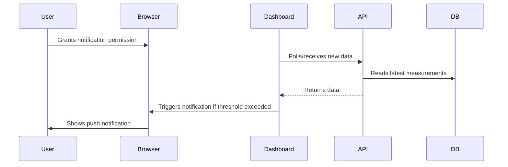
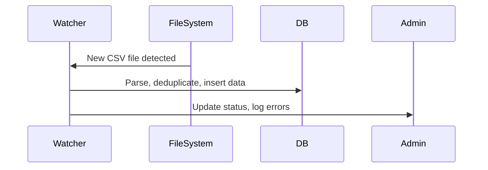
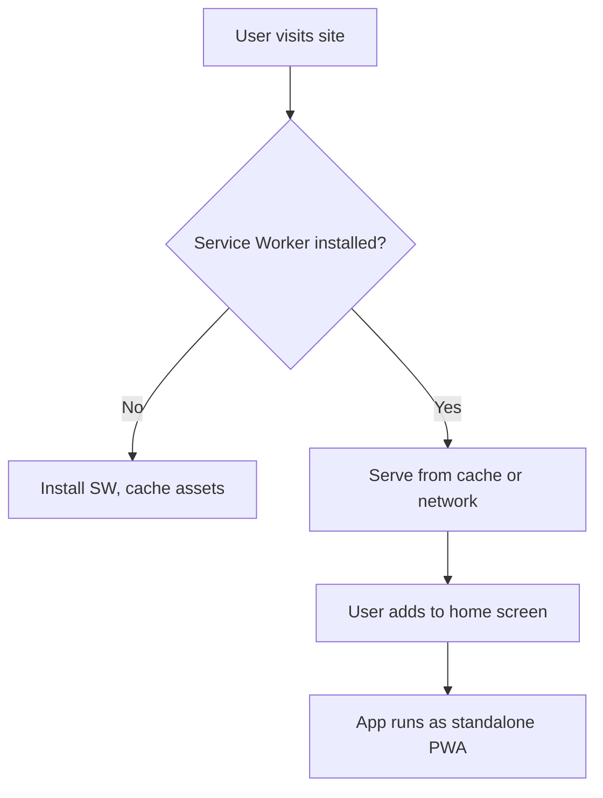

# Noise Monitoring Dashboard - In-Depth Technical & Operational Documentation

---

## 📖 Table of Contents

1. [Project Overview](#project-overview)
2. [Key Features](#key-features)
3. [System Architecture](#system-architecture)
4. [Technology Stack](#technology-stack)
5. [Project Structure](#project-structure)
6. [Installation & Setup](#installation--setup)
7. [Configuration](#configuration)
8. [Usage Guide & User Stories](#usage-guide--user-stories)
9. [API Reference & Contracts](#api-reference--contracts)
10. [Database Schema & Analytics](#database-schema--analytics)
11. [Security, Privacy & Compliance](#security-privacy--compliance)
12. [Testing & Quality Assurance](#testing--quality-assurance)
13. [Accessibility & Internationalization](#accessibility--internationalization)
14. [Deployment, Scaling & Maintenance](#deployment-scaling--maintenance)
15. [Monitoring, Logging & Backup](#monitoring-logging--backup)
16. [Troubleshooting & Example Logs](#troubleshooting--example-logs)
17. [Glossary](#glossary)
18. [Contributing](#contributing)
19. [License & Acknowledgments](#license--acknowledgments)

---

## 1. Project Overview

The **Noise Monitoring Dashboard** is a production-grade, real-time web platform for environmental noise and weather monitoring at events, festivals, and public spaces. It is designed for:
- **Event organizers** (compliance, live monitoring, reporting)
- **Authorities** (regulatory oversight, evidence)
- **Technical staff** (infrastructure, troubleshooting)
- **Stakeholders** (public relations, transparency)

**Key Goals:**
- Ensure legal compliance (e.g., noise ordinances, GDPR)
- Provide actionable, real-time insights
- Enable rapid response to threshold violations
- Support historical analysis and reporting

---

## 2. Key Features

### Real-Time Data Pipeline
- **15-min interval aggregation** (configurable)
- **Multi-station support** (scalable to N locations)
- **Weather correlation** (wind, humidity, direction)
- **Data retention**: Configurable, default 1 year (see [Compliance](#security-privacy--compliance))

### Alerts & Notifications
- **Push notifications** (browser, mobile PWA)
- **Configurable thresholds** (per station, per time-of-day)
- **Notification anti-spam**: 1 alert per threshold per 10 min (configurable)
- **Audit log**: All alerts are logged for compliance

### Data Visualization
- **KPI cards**: Current, average, max, min, trend, status
- **Interactive charts**: Zoom, tooltip, weather overlays
- **Tabular data**: Filter by time, threshold, export
- **Export**: CSV, JSON, PDF (planned)

### Automation & Admin
- **CSV watcher**: Monitors directories, debounces duplicate files
- **Manual import**: Admin UI for on-demand processing
- **Health dashboard**: DB status, watcher status, last import, error logs
- **Role-based access** (planned): Admin, Operator, Viewer

### PWA & Mobile
- **Installable**: Manifest, icons, splash, offline
- **Service worker**: Caches UI, fallback for data
- **Mobile-first design**: Touch, accessibility, responsive

---

## 3. System Architecture

### High-Level Diagram
```mermaid
graph TD
  subgraph User
    A[Browser / Mobile Device]
  end
  subgraph Frontend
    B[Next.js React App]
    C[PWA Service Worker]
  end
  subgraph Backend
    D[API Routes (Next.js)]
    E[CSV Watcher]
    F[Database (SQLite)]
    G[Weather Fetcher]
  end
  subgraph External
    H[Weather API (weisserstein.info)]
    I[CSV Files]
  end
  A <--> B
  B <--> D
  B <--> C
  D <--> F
  D <--> G
  G <--> H
  E <--> I
  E <--> F
```

### Notification Flow


### CSV Ingestion Flow


### PWA Lifecycle


---

## 4. Technology Stack

- **Frontend**: Next.js 15, React 18, TypeScript 5+
- **Styling**: Tailwind CSS, Framer Motion
- **Charts**: Recharts (with custom tooltip, legend, overlays)
- **Database**: SQLite (better-sqlite3, file-based, ACID)
- **Weather API**: weisserstein.info (can be swapped)
- **Notifications**: Browser Notifications API (with permission fallback)
- **PWA**: Service Worker, Manifest, offline caching
- **CSV Parsing**: papaparse (robust, handles edge cases)
- **Testing**: Jest, React Testing Library, Playwright (E2E, planned)
- **CI/CD**: GitHub Actions (lint, test, build)

---

## 5. Project Structure

```
noise-monitoring-dashboard/
├── app/
│   ├── dashboard/          # Dashboard pages (all, ort, techno, heuballern, band, export, admin)
│   └── api/                # API routes (weather, station-data, process-csv, csv-watcher-status)
├── components/
│   ├── ui/                 # UI components (cards, buttons, tooltips, etc.)
│   └── theme-provider.tsx
├── hooks/
│   └── useStationData.ts   # Data fetching and aggregation hook
├── lib/
│   ├── db.ts               # Database logic
│   ├── weather.ts          # Weather integration
│   ├── csv-watcher.ts      # File watcher for CSVs
│   └── utils.ts            # Utility functions
├── public/
│   └── csv/                # CSV data files (per station)
├── styles/                 # Global styles
├── tests/                  # Unit/integration tests (planned)
├── .github/                # Workflows, issue templates
├── package.json            # Dependencies and scripts
├── README.md               # Quickstart and German docs
├── DOCUMENTATION.md        # This file
└── ...
```

---

## 6. Installation & Setup

### Prerequisites
- Node.js 18+
- pnpm (recommended) or npm
- SQLite3 (CLI for manual DB inspection)
- Linux/macOS/Windows (tested on all)

### Quick Start
```bash
# Clone the repository
git clone <repository-url>
cd noise-monitoring-dashboard

# Install dependencies
pnpm install

# Start the development server
pnpm dev
```

### Environment Variables
Create a `.env` file (optional):
```env
DATABASE_PATH=./data.sqlite  # Path to SQLite DB
CSV_WATCH_INTERVAL=10        # Seconds between directory scans
WEATHER_API_URL=https://weisserstein.info/api
```

### Production Build
```bash
pnpm build
pnpm start
```

### Advanced: Custom Database Path
- Use `DATABASE_PATH` to store DB on a mounted volume for backup
- For Docker, mount `/data` and set `DATABASE_PATH=/data/noise.sqlite`

---

## 7. Configuration

### Adding a New Station
1. Place CSV files in `public/csv/<station-name>/`
2. Add station config in `hooks/useStationData.ts`:
   ```typescript
   export const STATIONS = [
     { name: "ort", label: "Ort", color: "emerald" },
     { name: "techno", label: "Techno Floor", color: "pink" },
     // ...
   ];
   ```
3. Create a dashboard page in `app/dashboard/<station-name>/page.tsx`
4. (Optional) Add to navigation and admin

### Thresholds & Alert Levels
Edit in `hooks/useStationData.ts`:
```typescript
const WARNING_THRESHOLD = 55; // dB
const ALARM_THRESHOLD = 60;   // dB
```
- **Advanced:** Use time-of-day or event-based thresholds for night/day

### Weather Update Interval
Edit in `lib/db.ts`:
```typescript
const WEATHER_UPDATE_INTERVAL = 10; // minutes
```

### CSV File Format & Edge Cases
- Expected columns: `Messnummer;Datum;Systemzeit ;LAS;LS;Effektiver Schalldruck;...`
- Heuballern uses `LAF` instead of `LAS` for noise
- Files must be UTF-8 and semicolon-separated
- **Edge Cases:**
  - Extra columns are ignored
  - Missing values are skipped
  - Duplicate rows (by timestamp) are deduplicated
  - Corrupt files are logged and skipped

**Example:**
```csv
Messnummer;Datum;Systemzeit ;LAS;LS;Effektiver Schalldruck
1;25.06.2024;23:20:55:741;49,8;64,3;0,03298097
```

---

## 8. Usage Guide & User Stories

### Dashboard Navigation
- **All Locations**: `/dashboard/all` — Overview of all stations, quick status, combined chart
- **Station Dashboards**: `/dashboard/ort`, `/dashboard/techno`, etc. — Detailed KPIs, charts, weather
- **Tables**: `/dashboard/<station>/table` — Tabular data, filtering, export
- **Export**: `/dashboard/export` — Download CSVs for any station/time range
- **Admin**: `/admin` — Watcher status, manual CSV processing, system health

### User Story: Festival Night
> As a festival operator, I want to see all noise levels at a glance, get notified if any station exceeds the limit, and export a report for the authorities.

**Scenario:**
1. Operator opens `/dashboard/all` on a tablet
2. Sees all stations are "Normal" except Bandbühne (Warning)
3. Clicks Bandbühne card for details: sees wind is from SW, noise is rising
4. Receives push notification: "Alarm: Bandbühne 61.2 dB at 22:15, wind SW 12 km/h"
5. Uses table view to check all exceedances for the night
6. Exports CSV for compliance reporting

### User Story: Compliance Officer
> As a compliance officer, I want to review historical data, filter for exceedances, and download evidence for a specific date range.

**Scenario:**
1. Officer logs in to `/dashboard/all/table`
2. Filters for "Alarm" status only
3. Selects date range for the event
4. Downloads CSV for submission

### Accessibility & Tooltips
- All KPI cards, buttons, and charts have tooltips explaining their purpose and data
- Status badges (Normal/Warning/Alarm) have color and text cues
- Keyboard navigation and screen reader support for all interactive elements
- **Best Practice:** Use `aria-label` and semantic HTML for all controls

---

## 9. API Reference & Contracts

### Station Data API
- **Endpoint:** `/api/station-data?station=<name>&interval=24h|7d`
- **Method:** GET
- **Returns:** Array of measurements with weather
- **Error Codes:**
  - `400`: Missing or invalid parameters
  - `500`: Internal server/database error

**Example Request:**
```
GET /api/station-data?station=ort&interval=24h
```
**Example Response:**
```json
[
  {
    "time": "23:15",
    "las": 61.2,
    "ws": 12.0,
    "wd": "SW",
    "rh": 65
  },
  ...
]
```

### Weather API
- **Endpoint:** `/api/weather`
- **Method:** GET
- **Returns:**
```json
{
  "windSpeed": 12.5,
  "windDir": "SW",
  "relHumidity": 65.2
}
```
- **Error Codes:**
  - `500`: Weather API unavailable

### CSV Processing API
- **Endpoint:** `/api/process-csv`
- **Method:** POST
- **Returns:**
```json
{
  "success": true,
  "processedFiles": 5,
  "message": "Processing completed"
}
```
- **Error Codes:**
  - `500`: File system or parsing error

### CSV Watcher Status API
- **Endpoint:** `/api/csv-watcher-status`
- **Method:** GET
- **Returns:**
```json
{
  "watcherActive": true,
  "watchedDirectories": [
    {
      "station": "ort",
      "path": "/path/to/csv",
      "files": [ ... ],
      "fileCount": 10
    }
  ],
  "totalFiles": 40,
  "lastCheck": "2024-01-10T10:00:00Z"
}
```
- **Error Codes:**
  - `500`: File system error

### API Best Practices
- Always validate input parameters
- Use HTTP status codes for error handling
- Log all errors with timestamps and context
- **Anti-pattern:** Returning stack traces to the client

---

## 10. Database Schema & Analytics

### Measurements Table
```sql
CREATE TABLE measurements (
  id INTEGER PRIMARY KEY AUTOINCREMENT,
  station TEXT NOT NULL,
  time TEXT NOT NULL,
  las REAL NOT NULL,
  created_at DATETIME DEFAULT CURRENT_TIMESTAMP,
  source_file TEXT
);
```

### Weather Table
```sql
CREATE TABLE weather (
  id INTEGER PRIMARY KEY AUTOINCREMENT,
  station TEXT NOT NULL,
  time TEXT NOT NULL,
  wind_speed REAL,
  wind_dir TEXT,
  rel_humidity REAL,
  created_at DATETIME DEFAULT CURRENT_TIMESTAMP
);
```

### Indexes
```sql
CREATE INDEX idx_measurements_station_time ON measurements(station, time);
CREATE INDEX idx_weather_station_time ON weather(station, time);
```

### Example Analytics Queries
- **Daily Exceedances:**
  ```sql
  SELECT date(created_at), COUNT(*) FROM measurements WHERE las >= 60 GROUP BY date(created_at);
  ```
- **Average Noise by Station:**
  ```sql
  SELECT station, AVG(las) FROM measurements GROUP BY station;
  ```
- **Peak Noise with Weather:**
  ```sql
  SELECT m.station, m.time, m.las, w.wind_speed, w.wind_dir
  FROM measurements m
  JOIN weather w ON m.station = w.station AND m.time = w.time
  WHERE m.las = (SELECT MAX(las) FROM measurements WHERE station = m.station)
  ```

### Data Retention & GDPR
- Default retention: 1 year (configurable)
- Data can be anonymized or deleted on request
- All access and exports are logged

---

## 11. Security, Privacy & Compliance

### Security
- **HTTPS**: Enforced for all endpoints and PWA
- **Input validation**: All API and file inputs sanitized
- **Role-based access**: Admin dashboard should be protected (see [Deployment](#deployment-scaling--maintenance))
- **No sensitive data**: Never expose stack traces or secrets to the client

### Privacy & GDPR
- **Data minimization**: Only store necessary fields
- **Right to be forgotten**: Support for data deletion
- **Export logs**: All exports are logged with user and timestamp
- **Consent**: Notification permission is opt-in

### Compliance
- **Noise ordinances**: Thresholds and reporting align with local laws
- **Data protection**: Follows GDPR best practices

---

## 12. Testing & Quality Assurance

### Unit Testing
- Use Jest for all utility and data functions
- Example:
  ```typescript
  test('parseCSV skips corrupt rows', () => { ... })
  ```

### Integration Testing
- Use React Testing Library for UI flows
- Mock API responses for edge cases

### End-to-End (E2E) Testing
- Use Playwright or Cypress (planned)
- Test PWA install, notification, CSV import flows

### CI/CD
- GitHub Actions: Lint, test, build on every PR
- **Best Practice:** Block merge on failed tests

---

## 13. Accessibility & Internationalization

### Accessibility (a11y)
- All interactive elements have `aria-label` and keyboard support
- Color contrast meets WCAG AA
- Tooltips are accessible via keyboard and screen reader
- **Anti-pattern:** Relying on color alone for status

### Internationalization (i18n)
- All UI text is in English and German (see `i18n/`)
- Date/time formats are locale-aware
- **Best Practice:** Use translation keys, not hardcoded strings

---

## 14. Deployment, Scaling & Maintenance

### Deployment
- Vercel: Zero-config, auto-scaling, HTTPS
- Docker: For on-prem or private cloud
- Manual: For custom environments

### Scaling
- SQLite is file-based; for high write volume, consider PostgreSQL
- Use Docker volumes for persistent storage
- For multi-instance, use a shared DB and object storage for CSVs

### Backup & Disaster Recovery
- Schedule DB dumps (e.g., `sqlite3 data.sqlite .dump > backup.sql`)
- Store backups offsite (cloud, SFTP)
- Test restore regularly

### Maintenance
- Monitor logs and health dashboard
- Rotate logs and prune old data
- Upgrade dependencies monthly
- **Best Practice:** Use Dependabot or similar for security updates

---

## 15. Monitoring, Logging & Backup

### Monitoring
- Use built-in admin dashboard for health
- Integrate with external tools (e.g., Grafana, Prometheus) via API

### Logging
- All errors, warnings, and alerts are logged with timestamp and context
- Logs are rotated and archived
- **Example log entry:**
  ```json
  { "level": "error", "time": "2024-06-25T22:15:00Z", "msg": "CSV parse error", "file": "band_20240625.csv", "line": 123 }
  ```

### Backup
- Nightly DB dumps to `/backups` (cron job)
- CSV files are archived after import
- **Best Practice:** Test restore monthly

---

## 16. Troubleshooting & Example Logs

### Example: Weather API Failure
- **Log:**
  ```json
  { "level": "error", "time": "2024-06-25T22:00:00Z", "msg": "Weather API unavailable", "station": "ort" }
  ```
- **Resolution:**
  - Check internet connection
  - Retry after 5 min (auto-retry is built-in)
  - If persistent, switch to backup API

### Example: CSV Import Error
- **Log:**
  ```json
  { "level": "error", "time": "2024-06-25T22:10:00Z", "msg": "CSV parse error", "file": "band_20240625.csv", "line": 123 }
  ```
- **Resolution:**
  - Check file encoding and format
  - Remove corrupt row, re-upload
  - Watcher will retry on next scan

### Example: Notification Not Delivered
- **Log:**
  ```json
  { "level": "warn", "time": "2024-06-25T22:15:00Z", "msg": "Notification permission denied", "user": "operator1" }
  ```
- **Resolution:**
  - Instruct user to enable notifications in browser

---

## 17. Glossary

- **KPI**: Key Performance Indicator (e.g., current dB, trend)
- **PWA**: Progressive Web App (installable, offline-capable)
- **CSV Watcher**: Background process that monitors for new data files
- **Threshold**: Configurable noise level for warnings/alarms
- **GDPR**: General Data Protection Regulation (EU privacy law)
- **a11y**: Accessibility
- **i18n**: Internationalization
- **E2E**: End-to-end (testing)
- **API Contract**: Formal definition of request/response structure

---

## 18. Contributing

See [Development Workflow](#development-workflow) for details. All contributions must:
- Pass linting and tests
- Include/Update documentation
- Follow code style and commit conventions

---

## 19. License & Acknowledgments

### License
MIT License

### Acknowledgments
- **Weather Data**: weisserstein.info
- **UI Components**: shadcn/ui
- **Charts**: Recharts
- **Animations**: Framer Motion
- **PWA Tools**: Next.js PWA Support

---

**Developed for the Wood-One Live Festival** 🎵

**Version 2.0** — Now with intelligent tooltips, PWA support, and automatic data processing. 